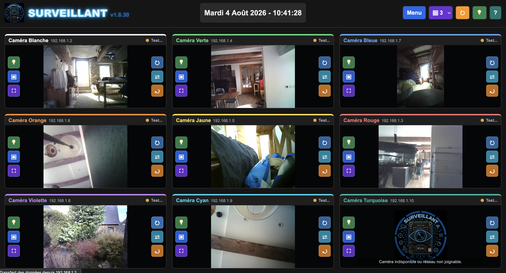

# Surveillant

Surveillant est une page HTML autonome permettant de recuperer, afficher et piloter un ou plusieurs flux video ESP32-CAM sur un reseau local.

La version actuelle est `v1.8.31`.

## Apercu




## Fonctionnalites

- Affichage multi-flux ESP32-CAM depuis des IP locales.
- Agencement configurable de `Auto` a `8` colonnes.
- Agencement par defaut en 3 flux par ligne.
- Date centrale en format numerique ou en toutes lettres.
- Date en toutes lettres activee par defaut.
- Commandes par camera : LED, capture PNG, rafraichissement, miroir, rotation et plein ecran.
- Bouton global pour basculer toutes les LED.
- Captures PNG avec telechargement direct ou dossier choisi quand le navigateur le permet.
- Menu de configuration des cameras avec IP, libelle, couleur et ajout/suppression.
- Themes visuels sauvegardes dans le navigateur.
- Mode Surveillance avec barre du haut conservee et flux maximises.
- Messages discrets en filigrane sur les flux, effaces automatiquement apres 30 secondes.

## Fichiers

- `surveillant-v1.8.31.html` : application principale.
- `surveillant.png` : logo et favicon.
- `surveillant_off.png` : image affichee quand un flux video est indisponible.
- `capture-proxy.js` : proxy local optionnel pour contourner certains blocages CORS lors des captures.
- `surveillant_esp32cam.ino` : sketch ESP32-CAM associe au projet.
- `CHANGELOG.md` : historique des versions.
- `screenshots/` : captures utilisees dans ce README.

## Utilisation

Ouvrir `surveillant-v1.8.31.html` dans un navigateur.

Dans le menu :

- renseigner les IP des cameras a afficher ;
- verifier le chemin du flux, generalement `/stream` ;
- verifier le chemin de capture, generalement `/capture` ;
- choisir l'agencement des flux ;
- choisir le format de date ;
- enregistrer.

Les reglages sont conserves dans le navigateur avec `localStorage`.

## Sketch ESP32-CAM

Le fichier `surveillant_esp32cam.ino` est fourni avec le projet. Il est pret a etre televerse dans une ou plusieurs ESP32-CAM, apres adaptation des informations propres a votre reseau.

Avant de televerser le sketch, renseigner :

- `ssid` : nom du reseau Wi-Fi ;
- `password` : mot de passe du reseau Wi-Fi ;
- `local_IP[3]` : numero final de l'adresse IP de la camera.

Exemple :

```cpp
const char* ssid = "nom du reseau";
const char* password = "mot de passe du reseau";

local_IP[3] = 2;
```

Le sketch recupere automatiquement la passerelle et le masque en DHCP, puis force une IP fixe dans le meme sous-reseau en modifiant le dernier nombre de l'adresse.

Il faut donc televerser le meme sketch sur chaque ESP32-CAM en changeant `local_IP[3]` pour donner un numero unique a chaque camera, puis reporter l'IP correspondante dans le menu de Surveillant.

### Securite Des Cameras

Il est fortement deconseille d'exposer directement les ESP32-CAM sur Internet.

Eviter notamment :

- les redirections de ports depuis la box vers les cameras ;
- l'ouverture directe des routes `/stream`, `/capture`, `/led/on` ou `/led/off` depuis l'exterieur ;
- l'utilisation des cameras sur un Wi-Fi public ou partage sans isolation.

Les ESP32-CAM utilisent ici des routes HTTP simples, sans authentification forte ni chiffrement HTTPS. Toute personne capable d'atteindre l'adresse IP de la camera pourrait potentiellement voir le flux ou piloter la LED.

Pour un acces depuis l'exterieur, preferer une solution plus sure : VPN vers le reseau local, reseau IoT separe, ou acces distant controle par un service dedie.

### Reservation D'IP Sur La Box

Il est conseille de reserver les adresses IP des ESP32-CAM dans l'interface de la box ou du routeur.

Le principe : associer l'adresse MAC de chaque ESP32-CAM a une IP fixe, par exemple :

- camera blanche : `192.168.1.2` ;
- camera rouge : `192.168.1.3` ;
- camera verte : `192.168.1.4`.

C'est utile parce que :

- Surveillant retrouve toujours les cameras au meme endroit ;
- les IP ne changent pas apres redemarrage de la box ou des ESP32-CAM ;
- cela evite les conflits entre deux appareils qui voudraient utiliser la meme adresse ;
- la maintenance est plus simple quand chaque camera a une IP connue et documentee.

Si une reservation DHCP est faite dans la box, verifier que le numero choisi dans `local_IP[3]` correspond bien a l'IP reservee pour cette camera.

## Compatibilite Navigateur

La page fonctionne comme un fichier HTML autonome pour l'affichage et les commandes principales.

Le choix d'un dossier de destination pour les captures depend du navigateur :

- Chrome et Edge peuvent proposer le choix de dossier quand la page est ouverte dans un contexte compatible.
- Firefox ne prend pas en charge `showDirectoryPicker`; les captures sont alors telechargees en PNG.

## Proxy De Capture Optionnel

Si une camera bloque la capture directe a cause de CORS, lancer le proxy local :

```bash
node capture-proxy.js
```

Surveillant essaie alors de passer par :

```text
http://127.0.0.1:8787/capture
```

Le proxy reste optionnel : l'affichage des flux et les commandes de base peuvent fonctionner sans lui.

## Routes Attendues

Surveillant suppose par defaut que les ESP32-CAM exposent :

- `/stream` pour le flux video ;
- `/capture` pour une image fixe ;
- `/led/on` pour allumer la LED ;
- `/led/off` pour eteindre la LED.

Ces chemins peuvent dependre du firmware utilise.

## Securite

Surveillant pilote des cameras par URLs HTTP locales. Il ne chiffre pas les flux et ne protege pas les cameras par lui-meme.

Il est recommande de garder les cameras sur un reseau local protege, sans redirection de port directe vers Internet.
